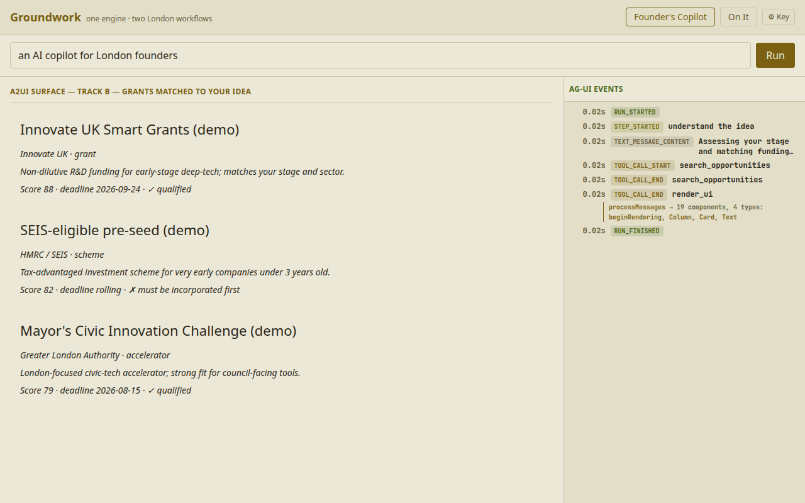
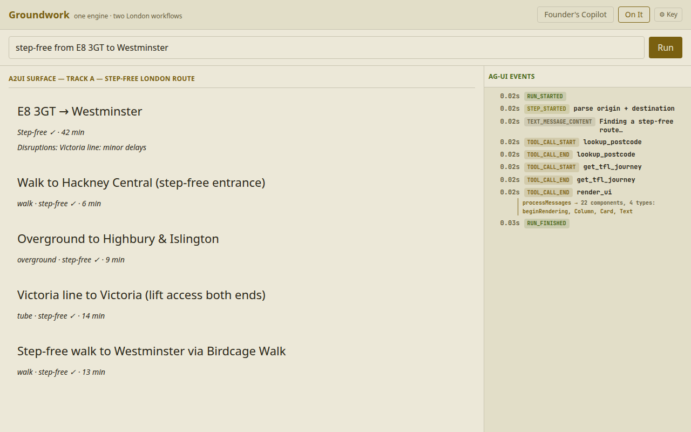

# Groundwork

> **A config-driven agent that streams its own UI.** On a single **Cloudflare Worker**, the model paints
> a live **A2UI** interface — not just text — and *swap a JSON, swap the app*.

**[▶ Live demo](https://qte77.github.io/ldnmxx-hack/)** · one engine, two London workflows — a
founder-funding copilot and step-free routing · Londonmaxxing 003.

[](LICENSE)
[](CHANGELOG.md)
[](https://github.com/qte77/ldnmxx-hack/actions/workflows/ci.yml)
[](https://www.codefactor.io/repository/github/qte77/ldnmxx-hack)

## What

Groundwork is the **engine** — for **builders** who want agent apps as *config, not code*, and the
Londoners each workflow serves (founders; step-free travellers). Two pillars: a **swappable workflow
engine** (swap a JSON, swap the app — each workflow's stage choreography is a `usecases/*.json` read at
runtime; render modes stay in code) and **generative UI** (the agent streams the interface, not just
text). The two workflows below are **interchangeable examples**, selected via the `?usecase=` query
param; add your own by dropping in a `usecases/*.json`.

```text
                  ┌─ Founder's Copilot · usecase=founders-copilot
   swap usecase ──┤  one toggle, same engine
                  └─ On It · usecase=on-it
                  │
                  ▼
User ─▶ UI ─▶ Workflow ─▶ Agent ─▶ Generative UI ──┐
▲       AG-UI runUsecase  OpenRtr  A2UI + HUD       │
└────────────── renders back to user ──────────────┘
```

- **The engine:** one `POST /run?usecase=<id>` + a small `runUsecase` interpreter (plan → tool → render) —
  each workflow's plan→tool→render choreography is a declarative `usecases/*.json`, selected by the
  `usecase` query param; render modes (`founders`/`route`) stay in code.
- **Generative UI:** the agent streams **AG-UI** events that render as built-in **A2UI cards** — it
  paints the interface, not just text (AG Grid deferred).
- **Example workflow — Founder's Copilot (flagship):** describe your idea → grants matched to it,
  qualify-first, plus a verified incorporate how-to pack (shipped today). Stage assessment (#18) and the
  live Companies House filing (#12) are planned.
- **Example workflow — On It (interchange proof):** a step-free London route — same engine, one
  `usecase` away (a canned stub today; live tools are planned).
- Keyless demo path; secrets stay Worker-only *(stack rationale below)*.

<details>
<summary>Screenshot — Founder's Copilot (Track B)</summary>

Grants matched to the idea, qualify-first gate, live AG-UI event stream.

<picture>
  <source media="(prefers-color-scheme: dark)" srcset="assets/images/groundwork-founders-dark.png">
  
</picture>

</details>

<details>
<summary>Screenshot — On It (Track A)</summary>

A step-free London route — same engine, one `usecase` away.

<picture>
  <source media="(prefers-color-scheme: dark)" srcset="assets/images/groundwork-on-it-dark.png">
  
</picture>

</details>

## How

```bash
make help    # all targets
make dev     # worker (:8787) + ui (:5173) locally, keyless
make test    # ui + worker tests
```

Toggle the two example workflows in the UI; `cd worker && npm run tail` shows one Arize span per stage.
**Demo:** <https://qte77.github.io/ldnmxx-hack/> (SPA) · <https://ldnmxx-hack-worker.cloudflare-driveway392.workers.dev>
(Worker API). Full map: [`docs/plans/001-build-plan.md`](docs/plans/001-build-plan.md).

**Switches:** `?usecase=founders-copilot|on-it` picks the workflow · `?demo=1` forces the keyless
deterministic stub even with a model key set · `?theme=light|dark` overrides the theme · BYOK sends
`Authorization: Bearer <key>` to the Worker instead of its server-side key.

## Why

One engine, many workflows — each a `usecases/*.json` selected via the `usecase` query param. Two examples prove it: funding
discovery (no single API) and civic routing (TfL ↔ council data siloed by mandate, not tech). A modular
agent built in a day joins what incumbents can't, and swaps between both from one core. See
[`docs/usecase-workflows.md`](docs/usecase-workflows.md).

## Stack — why these tools

- **Cloudflare** (Workers · Pages · Workers AI) — one serverless edge deploy, zero-ops; the Worker is the
  **trust boundary** (secrets server-side, sole egress). Workers AI serves the keyless free render chain;
  `data/demo/*.json` is the live data source (no KV; AI Gateway dormant, #29).
- **OpenRouter** — one key, many models. A BYOK key swaps the model with no code change; keyless runs use a
  **free chain** (Workers AI → OpenRouter `:free` → GitHub Models → stub), so the Worker rarely/never spends.
- **Arize** — LLM tracing: one span per stage (`plan → tool → render`), exported to Arize over **OTLP** when
  `ARIZE_API_KEY`+`ARIZE_SPACE_ID` are set (console otherwise); browser spans forward via `POST /trace`.

## Refs

- [Architecture](docs/architecture.md) · [User stories](docs/UserStory.md) ·
  [Use-case workflows](docs/usecase-workflows.md) · [Submission](docs/submission.md) ·
  [Design](docs/design.md) · [Demo script](docs/demo-script.md)
- Reuse base: [`qte77/agenthud-agui-a2ui`](https://github.com/qte77/agenthud-agui-a2ui) · fetcher:
  [`qte77/polyfetch-scrape`](https://github.com/qte77/polyfetch-scrape)

## License

Apache-2.0 — see [`LICENSE`](LICENSE) · third-party attribution in [`NOTICE`](NOTICE).
